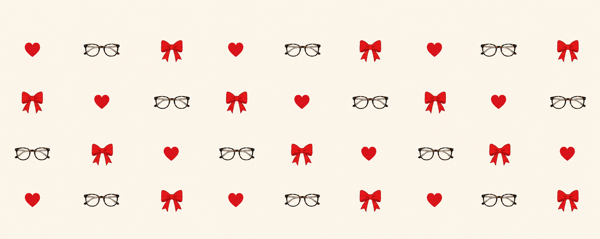

 

# 🍒 Custom Y2K Link-in-Bio

> **A link-in-bio, but make it Y2K.**
> A custom, highly stylized preppy/coquette link aggregator for musicians. Built with Vanilla web tech and powered by a Headless CMS.

 

🌍 **Read this in other languages:** <a href="#english">English</a> | <a href="#español">Español</a>

 

---

<h2 id="english">🇬🇧 English</h2>

**The Project**  
This repository contains a bespoke, cinematic link-in-bio website designed for an emerging music artist. Moving away from generic templates, it acts as a visual storytelling funnel using a magnetic scroll-snap layout. It seamlessly transitions from a video manifesto to a customizable link aggregator with a Y2K/Coquette aesthetic, followed by a dynamic polaroid collage and a final call-to-action.

**Key Features**  
* **Cinematic Scroll-Snapping:** 100vh sections with magnetic scroll to create an immersive, app-like experience.
* **Headless CMS Integration:** Powered by Decap CMS and Netlify Identity, allowing non-technical users to update videos, photos, links, and copy via an admin panel.
* **Dynamic Backgrounds:** Glassmorphism effects and precise CSS tunnel-lighting gradients ensure perfect visual continuity across the funnel.
* **Native Share Modal:** Custom-built sharing interface utilizing the Clipboard API and direct social platform links.

**Deployment & CMS Setup**  
1. Fork or clone this repository.
2. Deploy the project to **Netlify**.
3. Navigate to `Site settings > Identity` and enable **Identity** and **Git Gateway**.
4. Access `/admin/` to log in and start editing the content in real-time.

  <em>Coded with the Y2K style my friend wanted and having spent all the credits (sorry friend, you ran out of web for a month).</em>

  

<h2 id="español">🇪🇸 Español</h2>

**El Proyecto**  
Este repositorio contiene una web *link-in-bio* cinematográfica diseñada a medida para el lanzamiento de una artista musical. Lejos de las plantillas genéricas, funciona como un embudo visual utilizando un diseño de *scroll* magnético. Transiciona de manera inmersiva desde un vídeo manifiesto hasta un agregador de enlaces con estética Y2K/Coquette, pasando por un collage de fotos dinámico y una llamada a la acción final.

**Características Principales**  
* **Scroll Magnético Cinematográfico:** Secciones de 100vh que crean una experiencia narrativa inmersiva similar a una aplicación nativa.
* **Integración con Headless CMS:** Controlado por Decap CMS y Netlify Identity, permitiendo actualizar vídeos, fotos, enlaces y textos sin tocar el código fuente.
* **Iluminación Dinámica:** Efectos de cristal esmerilado (*glassmorphism*) y degradados CSS precisos que aseguran una continuidad visual perfecta de túnel oscuro.
* **Modal de Compartir Nativo:** Interfaz de compartir personalizada que utiliza la API del portapapeles y enlaces directos a plataformas sociales.

**Despliegue y Configuración del CMS**  
1. Haz un fork o clona este repositorio.
2. Despliégalo en **Netlify**.
3. Ve a `Site settings > Identity` y activa **Identity** y **Git Gateway**.
4. Accede a `/admin/` para iniciar sesión y editar el contenido en tiempo real.

  <em>Programado con el estilo Y2K que quería mi amiga y habiendo gastado todos los tokens (perdón amiga, te quedaste sin web un mes).</em>

